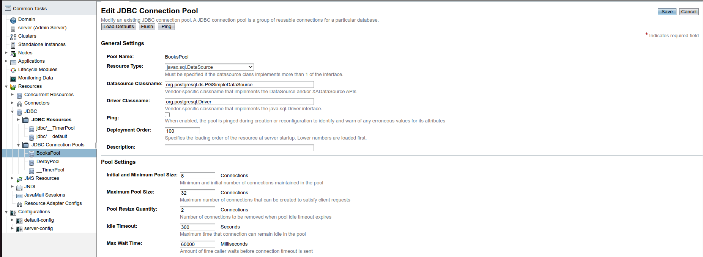
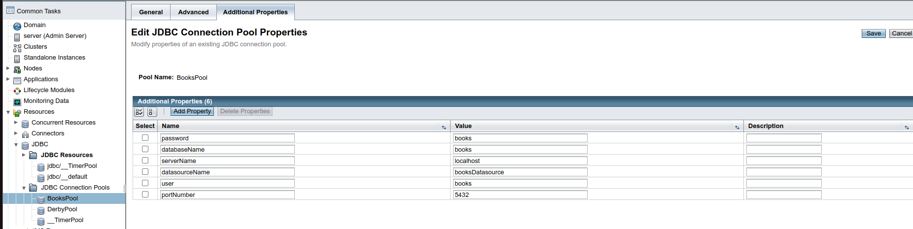
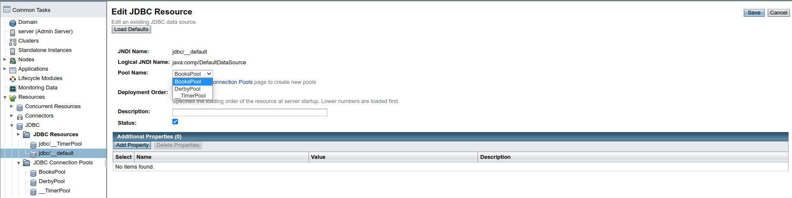

Install PostgreSQL using Docker
```shell
# Create directory for PostgreSQL database
PGDIR=$HOME/Data/books-pgsql
mkdir -p PGDIR

# Run PosgreSQL docker container
docker run -d --restart unless-stopped --name "books-pgsql" \
    -e POSTGRES_USER="books" \
    -e POSTGRES_PASSWORD="books" \
    -e POSTGRES_DB="books" \
    -e PGDATA=/var/lib/postgresql/data/pgdata \
    -v $PGDIR:/var/lib/postgresql/data \
    -p 5432:5432 \
    postgres:14.2
```

Download Glassfish and start domain
```shell
TEMP_DIR=$(mktemp -d)
wget -O $TEMP_DIR/'glassfish-6.2.5.zip' 'https://www.eclipse.org/downloads/download.php?file=/ee4j/glassfish/glassfish-6.2.5.zip'
unzip $TEMP_DIR/glassfish-6.2.5.zip -d $TEMP_DIR
GLASSFISH_BIN="$TEMP_DIR/glassfish6/bin"

wget -O $TEMP_DIR/postgresql-42.3.5.jar 'https://repo1.maven.org/maven2/org/postgresql/postgresql/42.3.5/postgresql-42.3.5.jar'
mv $TEMP_DIR/postgresql-42.3.5.jar $GLASSFISH_BIN/glassfish/lib

$GLASSFISH_BIN/asadmin create-domain --adminport 4848 --nopassword=true anokhin
$GLASSFISH_BIN/asadmin start-domain anokhin
```

Then open <http://localhost:4848> and configure JDBC DataSource







Then you need to build artifacts
```shell
git clone <repository_url> web-services-technologies-anokhin
cd web-services-technologies-anokhin
./gradlew build

git clone https://github.com/eclipse/transformer.git transformer
cd transformer
mvn package
cd -
```

Deploy JAX WS service
```shell
$GLASSFISH_BIN/asadmin deploy \
    --contextroot /jaxws \
    jax-ws-service/bundles/j2ee/build/libs/jaxws-j2ee-*.war
```

Deploy REST service
```shell
transformer/org.eclipse.transformer.cli/target/org.eclipse.transformer.cli-*.jar \
    rest-service/bundles/j2ee/build/libs/rest-j2ee-*.war
    
$GLASSFISH_BIN/asadmin deploy \
    --contextroot /rest \
    rest-service/bundles/j2ee/build/libs/output_rest-j2ee-*.war
```
